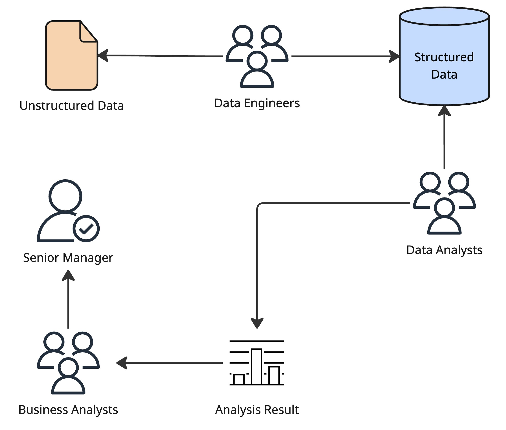
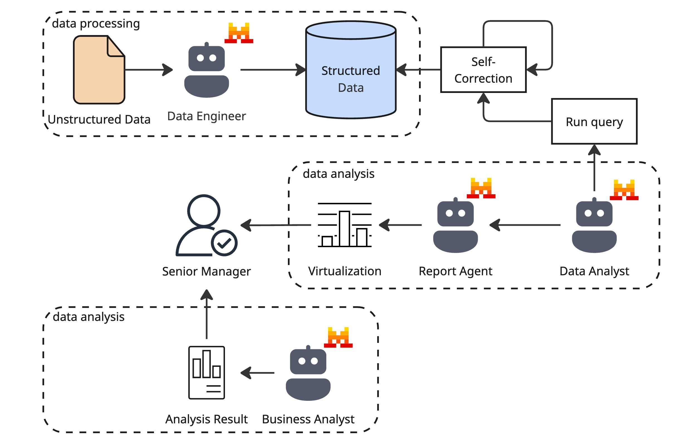

# Multi-Agent Data Analysis & Simulation Platform

[](https://www.python.org/)
[](LICENSE)

A sophisticated data analysis and simulation platform using a multi-agent workflow powered by Chainlit and Mistral AI. This application enables users to perform complex data queries and run what-if scenario simulations through natural language interactions.




## 🚀 Features

- **Natural Language Querying**: Ask data questions in plain English
- **Automatic SQL Generation**: AI converts questions to SQL queries
- **Scenario Simulation**: Run what-if analyses on your data
- **Visualization**: Automatic chart generation for results
- **Multi-Agent Architecture**: Specialized agents for different tasks
- **Interactive UI**: User-friendly Chainlit interface

## 📋 Table of Contents

- [Installation](#-installation)
- [Usage](#-usage)
- [Architecture](#-architecture)
- [Examples](#-examples)
- [Roadmap](#-roadmap)
- [Contributing](#-contributing)
- [License](#-license)

## 🛠️ Installation

### Prerequisites

- Python 3.11+
- [UV](https://github.com/astral-sh/uv) for package management (recommended)
- Mistral API key

### Steps

1. **Clone the repository**:
   ```bash
   git clone https://github.com/yourusername/data-analysis-agent.git
   cd data-analysis-agent
   ```

2. **Set up environment variables**:
   - Copy `.env.example` to `.env`
   - Add your Mistral API key to `.env`

3. **Create and activate virtual environment**:
   ```bash
   uv venv
   source .venv/bin/activate  # Linux/macOS
   # .\.venv\Scripts\activate  # Windows
   ```

4. **Install dependencies**:
   ```bash
   uv sync
   ```

5. **Run the application**:
   ```bash
   uv run -- chainlit run app.py -w
   ```

## 🎛️ Usage

### Starting the Application

1. Run the Chainlit app as shown above
2. Open the provided URL in your browser
3. Use the starter questions or ask your own

### Example Queries

- "Show total estimated revenue across all accounts in January 2025"
- "List the top 5 account names by available balance"
- "What if we raise deposit rates by 0.5%?"

### Workflow Visualization

Type "Show workflow" to see the system architecture diagram.

## 📊 Examples

### Chat Interface


### Query Results


### Simulation Output


## 🏛️ Architecture

The system uses a multi-agent approach:

1. **Router Agent**: Determines query intent
2. **Analysis Agent**: Handles data queries
3. **Simulation Agent**: Runs what-if scenarios
4. **Report Agent**: Generates visualizations

```mermaid
graph TD;
    A[User] --> B[Router Agent];
    B -->|Data Query| C[Analysis Agent];
    B -->|Simulation| D[Simulation Agent];
    C --> E[Database];
    D --> E;
    C --> F[Report Agent];
    D --> F;
    F --> A;
```

## 🗺️ Roadmap

- [ ] Add voice input support
- [ ] Implement more advanced simulation models
- [ ] Add user authentication
- [ ] Support additional data sources
